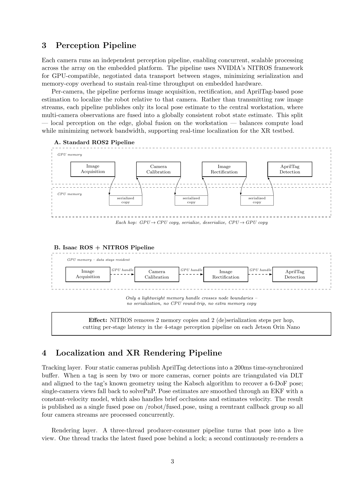

# Multi-Camera Launch Pipeline

Edge perception layer of the **3DGS XR Testbed for Robots** project. This is the
ROS 2 launch package that runs **on the Jetson attached to the physical camera
rig**: for every configured camera it stands up an isolated, GPU-accelerated
NITROS pipeline (driver → format conversion → rectification → AprilTag detection)
and publishes pose-only detections over the network. It does not fuse poses or
render anything — that happens downstream in
[`robotics-testbed-jetson-deployment-stack`](#related-repositories).

## Where this fits


This repo implements the **Physical Environment** and **Edge Perception Layer**
stages of the diagram above, plus the outbound half of the **Zenoh Communication
Layer**. Each camera's pipeline runs independently and concurrently, so the array
scales across however many cameras/Jetsons are attached; only per-camera pose
observations cross the network — never image streams.

## Perception pipeline

Every camera gets image acquisition, camera calibration, rectification, and
AprilTag detection, composed into a **single process per camera** so NVIDIA's
NITROS framework can negotiate zero-copy, GPU-resident data transport between
stages:



A standard ROS 2 pipeline pays for a GPU→CPU copy, a serialize, a deserialize,
and a CPU→GPU copy at every hop between nodes. NITROS instead passes a
lightweight GPU memory handle between stages, so the frame never leaves VRAM
until AprilTag detection is done — removing 2 memory copies and 2
(de)serialization steps per hop, which is what keeps 4 concurrent camera
pipelines real-time on a single Jetson Orin Nano.

Concretely, `launch/four_camera.launch.py` builds one `ComposableNodeContainer`
per camera (staggered 2s apart on startup, to avoid CUDA-init contention), each
containing:

1. **`spinnaker_camera_driver::CameraDriver`** — publishes distorted Mono8 at
   the pinned sensor geometry (binning off, 720×540 ROI at offset (360, 270) of
   the FLIR Firefly's native 1440×1080 sensor — ~45.5° horizontal FOV), 40 FPS.
2. **`ImageFormatConverterNode`** — converts Mono8 → RGB8. This has to sit
   *before* rectification: the undistort codelet needs matching input/output
   encodings, and letting NITROS negotiate rgb8 backwards from the detector
   while the driver still fed mono8 causes a hard pipeline failure.
3. **`RectifyNode`** — undistorts using the per-camera calibration in
   `calibration/*.yaml`. AprilTag detection needs this: cuAprilTags only takes
   `{fx, fy, cx, cy}` (no distortion coefficients), and these lenses' `k1 ≈ -0.39`
   is enough to cost ~7.7° of orientation and 7% of range on unrectified input.
4. **`AprilTagNode`** — detects `tag36h11` tags (`size: 0.16m` — the tag's black
   border square, not the printed sheet) and publishes `tag_detections`.

## Camera fleet configuration

`config/robot.yaml` is the hardware manifest: it lists which per-camera YAML
files (`config/<serial>.yaml`) are actually launched. The rig currently runs
**3 active FLIR Firefly cameras** — `25251937`, `25251936`, `25251947` — each
bound to a physical unit by serial number, with a matching calibration file in
`calibration/`.

A 4th camera (`25251925`) has config and calibration files present but is
**intentionally excluded** from `robot.yaml`: its calibration file is a
placeholder, and it's still configured for 2×2-binned full-FOV capture, which
doesn't match the other three cameras' binning-off 720×540 center-crop geometry
— mixing the two would hand the downstream fuser cameras whose intrinsics and
FOV silently disagree. See the warning comment at the top of
`config/25251925.yaml` before re-enabling it.

The camera layout itself (positions and look-at directions) was chosen using
the MILP solver in [`milpsolutionforcameraplacement`](#related-repositories).

## Communication layer

Detections leave the Jetson via a Zenoh bridge (`docker-compose.yml` +
`zenoh.json5`), configured to:
- **publish** each camera's `tag_detections` topic outward to the workstation, and
- **subscribe** to `/robot/fused_pose` and `/gsplat/raw_image` — the fused pose
  and rendered frame coming back from
  [`robotics-testbed-jetson-deployment-stack`](#related-repositories), for local
  monitoring on the same box.

`fastdds_nonblocking.xml` configures the local DDS layer for asynchronous,
best-effort publishing so a slow subscriber never blocks camera acquisition.

## Directory structure

```
multi-camera-launch-pipeline/
├── launch/four_camera.launch.py   # builds one composable-node container per camera
├── multi_camera_launch/           # ament_python package
├── config/
│   ├── robot.yaml                 # which cameras to launch
│   └── <serial>.yaml              # per-camera driver + AprilTag parameters
├── calibration/<serial>.yaml      # per-camera intrinsics/distortion (camera_info format)
├── calibration_firefly.py         # camera calibration capture/generation script
├── docker-compose.yml             # zenoh-bridge-ros2dds service
├── zenoh.json5                    # Zenoh bridge topic allow-lists
├── fastdds_nonblocking.xml        # DDS QoS profile (async, best-effort)
└── test/                          # ament lint/style tests
```

## Requirements

- NVIDIA Jetson Orin Nano (up to 4 cameras per device)
- ROS 2 Humble + NVIDIA Isaac ROS (`isaac_ros_image_proc`, `isaac_ros_apriltag`)
- `spinnaker_camera_driver` (FLIR Spinnaker SDK) for FLIR Firefly USB3 cameras
- `eclipse/zenoh-bridge-ros2dds` (pulled via `docker-compose.yml`)

## Usage

```bash
# Build the launch package (from a colcon workspace containing this repo)
colcon build --packages-select multi_camera_launch
source install/setup.bash

# Launch all cameras listed in config/robot.yaml
ros2 launch multi_camera_launch four_camera.launch.py \
    robot_config:=/path/to/config/robot.yaml

# In a separate terminal, bring up the Zenoh bridge to the workstation
docker compose up
```

## Known issues / current limitations

- **Resolution ceiling**: the pipeline hits its target frame rate (~40 FPS
  detection) at 720×540, but detection FPS and latency degrade severely at
  1440×1080 due to USB bandwidth limits and memory fragmentation.
- **Rectification distortion bug**: there is a known issue in the rectification
  node that introduces unusual image distortion at certain settings; it has
  been removed from some pipeline configurations pending a fix.

| Cameras | Camera FPS | Detection FPS | CPU % | Memory (MB) | GPU % | Detection latency (ms) |
|---|---|---|---|---|---|---|
| 1 | 40 | 39.9 | 20 | 2455 | 50 | 20 |
| 2 | 40 | 39.9 | 35 | 3200 | 60 | 22 |
| 3 | 30 | 39.9 | 55 | 4244 | 73 | 27 |
| 4 | 30 | 39.6 | 60 | 5200 | 82 | 28 |

## Related repositories

Part of the **3DGS XR Testbed for Robots** project, alongside:

- **`robotics-testbed-jetson-deployment-stack`** — subscribes to the
  `tag_detections` topics this repo publishes, fuses them into a single 6-DoF
  robot pose, and renders + streams the corresponding XR view back.
- **`milpsolutionforcameraplacement`** — the MILP optimizer used to choose this
  rig's camera count and layout.
